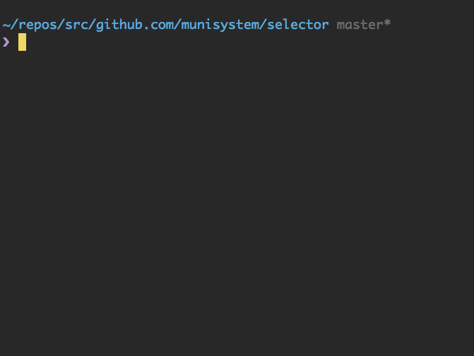
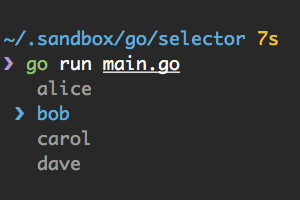
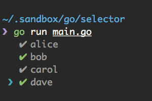

# Selector [](LICENSE)
Interactive command line user interfaces like [Inquirer.js](https://github.com/SBoudrias/Inquirer.js)



## Installation

```bash
$ go get -u github.com/munisystem/selector
```

## Examples
See ``example/`` folder

```bash
$ go run example/list.go
$ go run example/checkbox.go
```

## Usage

### List



```go
list := []string{"alice", "bob", "carol", "dave"}

// return selected element index
index, err := selector.List(list)
if err != nil {
    log.Fatal(err)
    os.Exit(1)
}

// when typed ESC key
if index == -1 {
    fmt.Println("Not selected")
    os.Exit(0)
}

fmt.Println(index) //=> 1
```

### Checkbox



```go
list := []string{"alice", "bob", "carol", "dave"}

// return slice into selected element indexes
indexes, err := selector.Checkbox(list)
if err != nil {
    log.Fatal(err)
    os.Exit(1)
}

// when typed ESC key or seleted nothing
if len(indexes) == 0 {
    fmt.Println("Not selected")
    os.Exit(0)
}

fmt.Println(indexes) //=> [1 3]
```

## Keybind

| Key         | Description           |
|:-----------:|:---------------------:|
| Enter       | Decision              |
| Esc         | Exit                  |
| Ctrl + n, j | Move to choices below |
| Ctrl + p, k | Move to choices above |
| Space       | Select (Checkbox)     |

## Author
munisystem