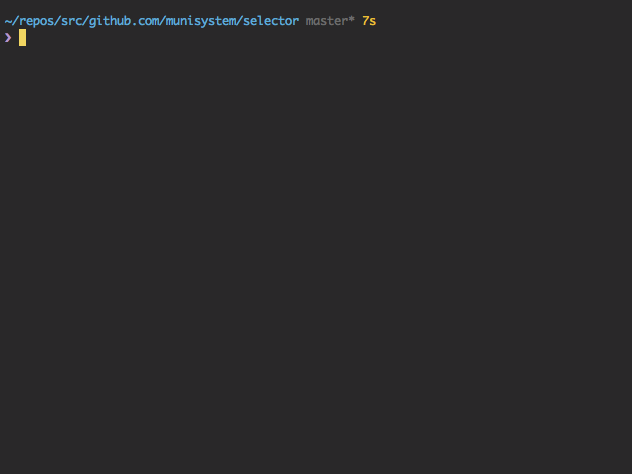

# Selector [](LICENSE)
Interactive command line user interfaces like [Inquirer.js](https://github.com/SBoudrias/Inquirer.js)

## Installation

```bash
$ go get github.com/munisystem/selector
```

## Usage

### List

[example/list.go](example/list.go)



```go
list := []string{"alice", "bob", "carol"}

// return selected element index
index, err := selector.List(list)
if err != nil {
    log.Fatal(err)
    os.Exit(1)
}

// when typed ESC key
if index == -1 {
    fmt.Println("Not selected")
    os.Exit(0)
}

fmt.Println(index) //=> 1
```

### Checkbox

[example/checkbox.go](example/list.go)


```go
list := []string{"alice", "bob", "carol"}

// return slice into selected element indexes
indexes, err := selector.Checkbox(list)
if err != nil {
    log.Fatal(err)
    os.Exit(1)
}

if len(indexes) == 0 {
    fmt.Println("Not selected")
    os.Exit(0)
}

fmt.Println(indexes) //=> [0 2]

```

## Author
munisystem